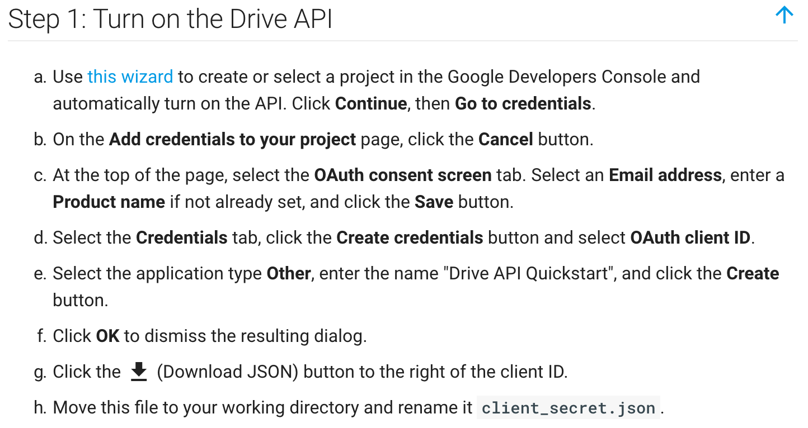

# python-drive

A simple [Google Drive API](https://code.google.com/archive/p/google-api-python-client/) python wrapper

## Getting Started

Before starting you will have to turn on the Google Drive API following these instructions:


### Prerequisites
To use python-drive the following libraries will need to be installed:
1. Google-api-python-client
```
$ pip install --upgrade google-api-python-client
```
2. Httplib2
```
$ pip install httplib2
```

### Authentication

Create a file named *client_secret.json* in the same directory as *main*. This file can be created by visiting the [Google API Console](https://console.developers.google.com) and selecting `Create Credentials`.


### Usage

*main/drive.py* provides the `Drive` class which allows the user to operate the Google Drive API in an object oriented way. The `Drive` class has simple methods such as **query**, **create_folder**, and **upload_file** that allow you to interact with your google drive account.

See the examples folder for specific usage.

## Authors

* **Alex Masi**

## License

This project is licensed under the MIT License - see the [LICENSE.md](LICENSE.md) file for details

## Acknowledgments

* Thank you:
  * google-drive-api
  * httplib2
* Originally created for use by the **UCONN Ariel Vehicle Society**
